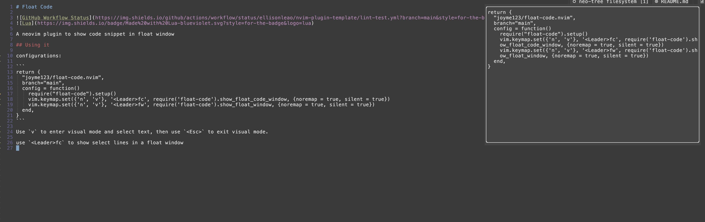

# Float Code


A neovim plugin to show code snippet in float window

## Using it

configurations:

```
return {
  "joyme123/float-code.nvim",
  branch="main",
  config = function()
    require("float-code").setup()
    vim.keymap.set({'n', 'v'}, '<Leader>fc', require('float-code').show_float_code_window, {noremap = true, silent = true})
    vim.keymap.set({'n', 'v'}, '<Leader>fw', require('float-code').show_float_window, {noremap = true, silent = true})
  end,
}
```

Use `v` to enter visual mode and select text, then use `<Esc>` to exit visual mode.

use `<Leader>fc` to show select lines in a float window


